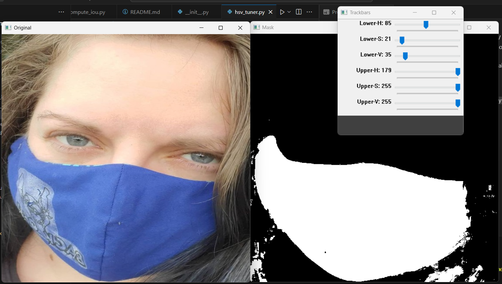
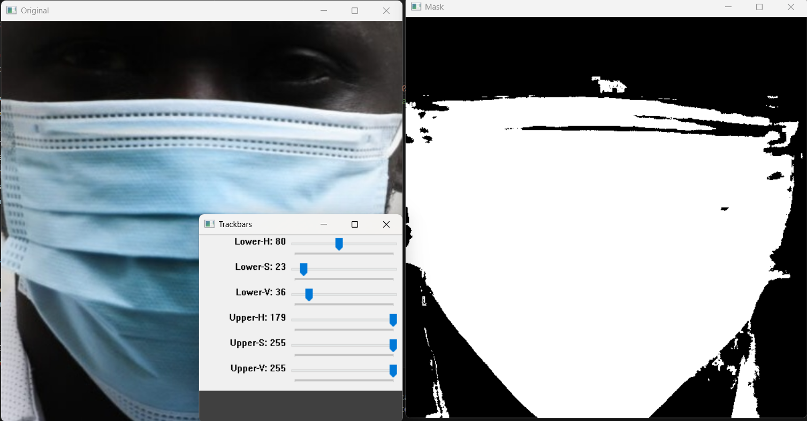
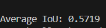
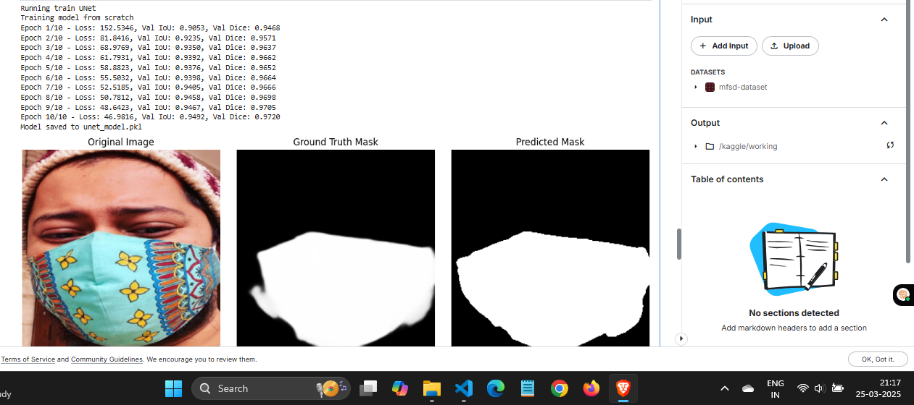
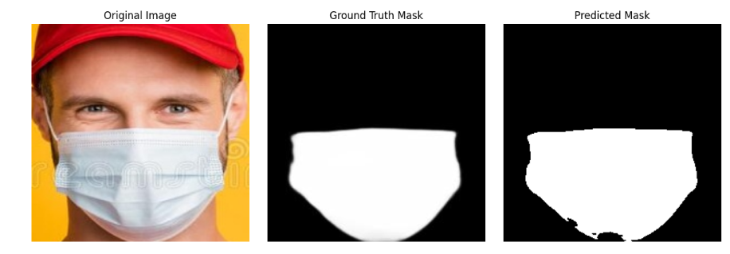
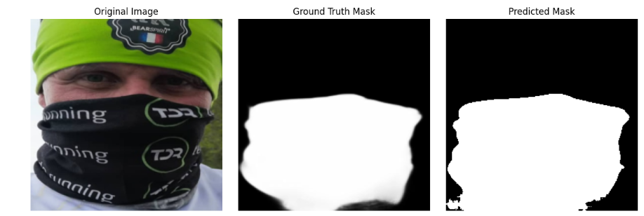
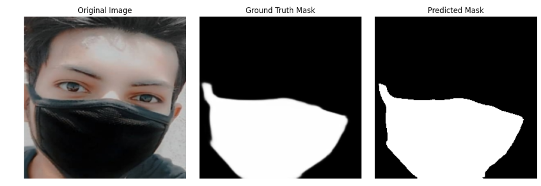
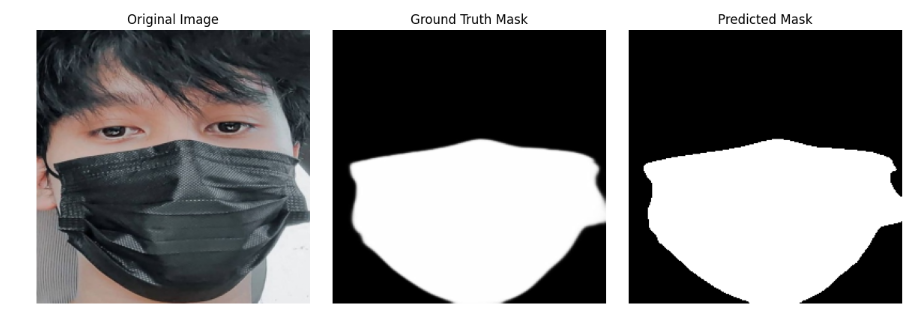

# Face Mask Detection and Segmentation Project

## Introduction
The objective of this project is to develop a computer vision solution for classifying and segmenting face masks in images. The approach involves using both traditional machine learning techniques with handcrafted features and deep learning models to achieve accurate classification and segmentation.

## Binary Classification Using Handcrafted Features and ML Classifiers
- Extract handcrafted features from the dataset to represent image characteristics.
- Train and evaluate at least two machine learning classifiers, such as Support Vector Machines (SVM) and Neural Networks, to distinguish between faces "with mask" and "without mask."
- Compare the accuracy and performance of these classifiers.

## Binary Classification Using CNN
- Design and train a Convolutional Neural Network (CNN) for binary classification.
- Experiment with hyper-parameter variations, such as learning rate, batch size, optimizer, and activation functions in the classification layer.
- Compare CNN performance with the machine learning classifiers to determine effectiveness.

## Region Segmentation Using Traditional Techniques
- Implement a region-based segmentation approach, such as thresholding or edge detection, to segment mask regions for faces identified as "with mask."
- Visualize and evaluate the segmentation results.

## Mask Segmentation Using U-Net
- Train a U-Net model for precise segmentation of mask regions in the images.
- Compare the performance of U-Net with traditional segmentation techniques using metrics like Intersection over Union (IoU) or Dice score.

   
## Dataset
- **Source**: 
  - Face Mask Detection Dataset: [GitHub Repository](https://github.com/chandrikadeb7/Face-Mask-Detection/tree/master/dataset)
  - Masked Face Segmentation Dataset: [GitHub Repository](https://github.com/sadjadrz/MFSD)
# Dataset Details

## Details
The dataset consists of images categorized into two classes: individuals wearing masks and individuals without masks.
## Structure
.
├── dataset<br>
│   ├── with_mask<br>
│   └── without_mask
- With mask contains individuals wearing mask images
- Without mask has individuals without mask images

- **MFSD (Masked Face Segmentation Dataset)**
- Source: Downloaded from Google Drive using the script in dataset/data_download.py
- Used for: Tasks 3 and 4 (Traditional segmentation and U-Net segmentation)
- Structure:
  - Contains original images of people wearing masks in MFSD_dataset/MSFD/1/face_crop
  - Includes pixel-level ground truth segmentation masks in MFSD_dataset/MSFD/1/face_crop_segmentation
  - Dataset information stored in MFSD_dataset/MSFD/1/dataset.csv

 # Binary Classification of Faces With and Without Masks

## a. Binary Classification Using Handcrafted Features and ML Classifiers (4 Marks)

### Methodology:
1. **Dataset Preparation**:  
   - Created a custom ImageDataset class to load images from the local directory.
   - Analyzed images and found a mix of grayscale and 4-channel images.
   - Converted all images to RGB and resized them to the mean size of **285x285**.
   - Transformed dataset for consistency.

2. **MLP on Raw Images**:  
   - Trained a Multi-Layer Perceptron (MLP) using raw images as input (flattened vectors).
   - Achieved **87% accuracy**.

3. **Handcrafted Feature Extraction**:  
   - Extracted **Histogram of Oriented Gradients (HOG)** and **Scale-Invariant Feature Transform (SIFT)** features.
     - **HOG**: Captures the distribution of gradient orientations to encode shape and texture.
     - **SIFT**: Detects key points and descriptors that are invariant to scale and rotation.
   - Used these features to train two classifiers: **SVM (SVC)** and **MLP**.

### Results:
| Classifier | Accuracy |
|------------|----------|
| **SVM (SVC)** | **88.52%** |
| **MLP** (Handcrafted Features) | **92.9%** |

### Hyperparameters:
- **MLP**: Optimizer - Adam, Learning Rate - 0.001, Batch Size - 200.
- **SVM (SVC)**: Default settings.

### Observations:
- MLP performed better than SVC as it is a better function approximator.
- Handcrafted features improved performance compared to raw image input.

---

## b. Binary Classification Using CNN (3 Marks)

### Methodology:
1. **CNN Architecture**:
   - Designed a CNN model for classification.
   - Initially used **average pooling** for flattening.
   - Found **information loss** due to pooling, leading to **78% accuracy**.

2. **Improved CNN**:
   - Replaced **average pooling** with **flattening after max pooling**.
   - Fully connected layers with input of size **24 × 35 × 35**.

### Results:
| Model | Accuracy |
|--------|----------|
| **CNN (Avg Pooling)** | **78%** |
| **CNN (Max Pooling + Flattening)** | **95.38%** |

### Hyperparameters:
- **Optimizer**: Adam
- **Learning Rate**: 0.001
- **Epochs**: 13
- **Tried Optimizers**: Adam, SGD (Adam converged faster)

### Observations:
- Adam optimizer led to **faster convergence**.
- Max pooling with flattening **preserved information** better than average pooling.
- CNN outperformed **SVM (88.52%)** and **MLP (92.9%)** in classification.

---

## Summary
- **Handcrafted Features + MLP** (92.9%) performed better than **SVM (88.52%)**.
- **CNN with max pooling** achieved the **best accuracy (95.38%)**.
- **Adam optimizer** helped CNN converge **faster** than SGD.


## Methodology for Traditional Segmentation (Part C)
## Experimental Approaches

### HSV and LAB Color Space Combination
**File**: `combine_hsv_lab.py`

We explored a more complex color-based segmentation approach that combined HSV and LAB color spaces:

#### Methodology:
- Convert image to HSV and LAB color spaces
- Create masks using:
  - Dark regions in HSV (for black mask areas)
  - Yellow regions in HSV (for logos)
  - L channel thresholding
  - B channel thresholding
- Combine multiple color space masks
- Apply morphological operations (closing, opening, dilation)

#### Challenges:
- Multiple color space masks led to complex segmentation
- Increased computational complexity
- Less consistent results compared to single HSV approach

### Haar Cascade and K-Means Clustering
**File**: `haar_cascade_and_kmeans.py`

An alternative approach combining face detection and image segmentation:

#### Technique:
- Use Haar cascade classifier for face detection
- Apply K-Means clustering for image segmentation
- Extract lower face regions

#### Limitations:
- Inconsistent face detection
- K-Means clustering not specifically tailored to mask segmentation
- High computational overhead

### Image Preprocessing
**File**: `resize_and_contrast_equalze.py`

Explored image preprocessing techniques to improve segmentation:

#### Preprocessing Steps:
- Resize images with padding
- Apply Contrast Limited Adaptive Histogram Equalization (CLAHE)
- Maintain aspect ratio during resizing

#### Benefits:
- Standardized image size
- Enhanced local image contrast
- Improved feature visibility

## Image Segmentation Approach
We developed a mask segmentation method using color-based thresholding and morphological operations:

1. **Color Space Conversion**: 
   - Converted images to HSV color space for better color-based segmentation
   - Used interactive HSV tuner to find optimal color range for mask detection

2. **Segmentation Techniques**:
   - Applied color thresholding using custom HSV range
   - Used morphological operations (closing and opening) to refine the mask
   - Selected the largest contour to create the final mask

### HSV Color Range Tuning
- Developed an interactive HSV tuner (`hsv_tuner.py`) to manually adjust color thresholds
- Final HSV range used: 
  - Lower Bound: `[85, 20, 30]`
  - Upper Bound: `[160, 255, 255]`

   
   

### Segmentation Process
1. Preprocess images by resizing
2. Convert to HSV color space
3. Create binary mask using color thresholding
4. Apply morphological operations
5. Extract largest contour as final mask
6. Only save those images whose white pixel percentage threshold of being in between 10% and 75%.

## Performance Evaluation

### Intersection over Union (IoU) Analysis
- Computed IoU between predicted and ground truth masks
- **Average IoU**: 0.5719 (57.19%)

   

### Visualization
Included sample images showing:
- Original images
- Extracted masks
- Segmented regions

## Key Challenges and Solutions
- Varying mask colors and materials
- Inconsistent lighting conditions
- Handling different mask styles

## How to Run the Code

### Prerequisites
- Python 3.7+

### Installation
1. Clone the repository
```bash
git clone https://github.com/yourusername/VR_Project1_YourName_YourRollNo.git
cd VR_Project1_YourName_YourRollNo
 ```

2. Create a virtual environment (optional but recommended)

```bash
python -m venv venv
source venv/bin/activate  # On Windows, use `venv\Scripts\activate`
```
3. Install dependencies

```bash
pip install -r requirements.txt
```
### Execution
Run the segmentation script:

```bash
python src/segmentation.py
```

### Task 4: U-Net Segmentation
1. Model Architecture:
   - Custom U-Net implementation defined in UNet class with:
     - Encoder path with 4 blocks: [3→64, 64→128, 128→256, 256→512]
     - Double convolution blocks with batch normalization and ReLU activation
     - Decoder path with skip connections from encoder
     - 2×2 max pooling in encoder and bilinear upsampling in decoder
     - Final 1×1 convolution and sigmoid activation for binary mask output

2. Training Approach:
   - Input images and masks resized to 256×256
   - Trained model loaded from checkpoint at epoch 10
   - Evaluated using IoU and Dice score metrics
   - Data loading with SegmentationDataset class for paired image-mask processing

3. Visualization Results:
   
   U-Net Segmentation Comparison:  
   The following image demonstrates better performance of U-Net segmentation as compared to traditional methods. The visualization shows original images (left side image), ground truth masks (middle image), and U-Net predicted masks (right side image).
   
   
   
   
   
   
   
   
   As visible in these examples, U-Net consistently produces clean, accurate mask boundaries that closely match the ground truth masks, even in challenging cases with different mask types, colors, and lighting conditions. The high IoU (93.62%) and Dice (96.44%) scores reflect this qualitative observation.

**NOTE** : Dataset was uploaded and code was executed on Kaggle due to non-availability of local GPU for execution.

## How to Run the Code


- Visit [Kaggle repository](https://www.kaggle.com/datasets/chiragdate/mfsd-dataset/data)
- Create a new notebook using more options button.
- Go to FILES and SELECT IMPORT NOTEBOOK
- Add the UNet.ipynb file link [Github repository](https://github.com/Mohit-Marfatia/Face-Mask-Detection-Classification-and-Segmentation/blob/5b5f9d88c2b18c1a8e4c532414f2e0f51ba4971c/src/UNet.ipynb)

### Execution
Run the ipynb file using run all button

### Comparison: Classification vs. Segmentation   
  - UNet (Task 4) surpassed traditional segmentation (Task 3) by better identifying object boundaries.  
  - Traditional methods showed acceptable recall but generally had lower precision.  

### Pros & Cons  
#### Classification  
-  CNNs perform well on large datasets.  
-  More tolerant of variations in image quality.   
-  Requires more computational resources than traditional classifiers.  
-  Deep models need more data to avoid overfitting.  

#### Segmentation  
-  UNet handles complex segmentation tasks effectively.  
-  Performs well with occlusions and overlapping regions.  
-  Needs a large annotated dataset for better performance.  
-  Training takes longer and needs powerful hardware.  
